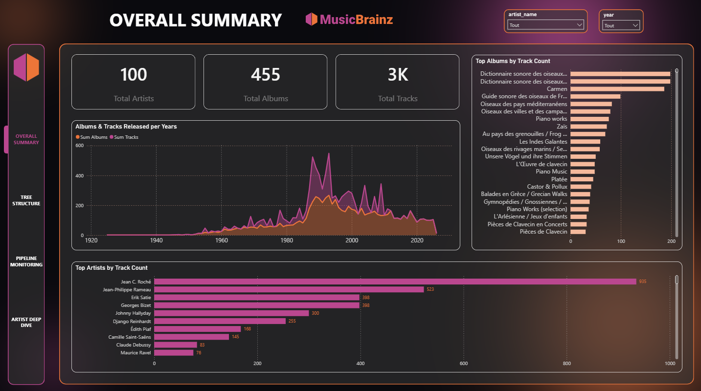
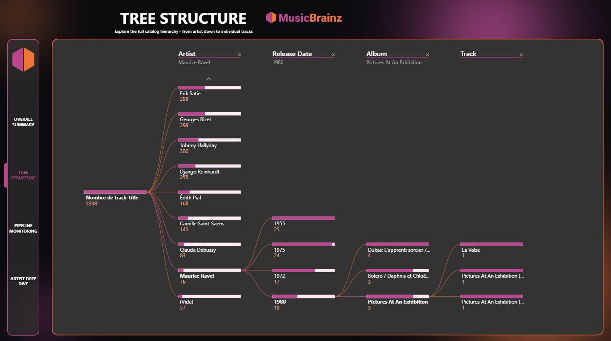
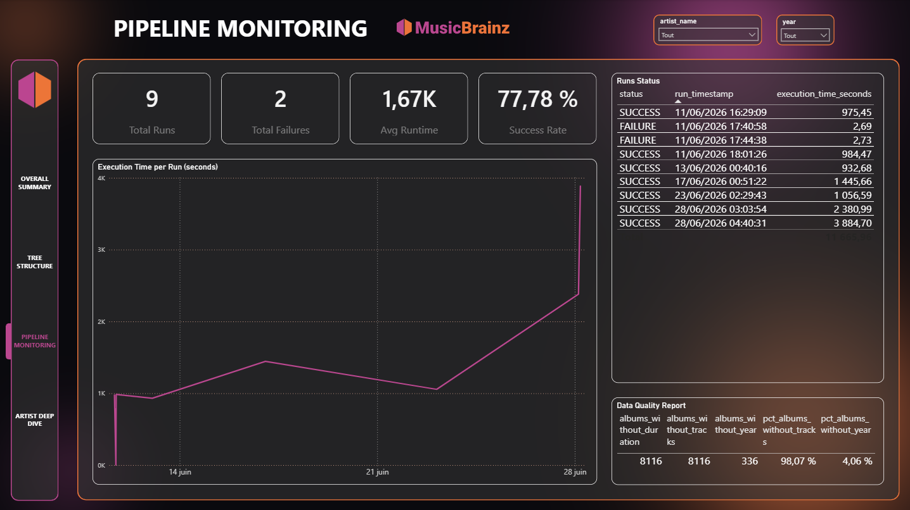
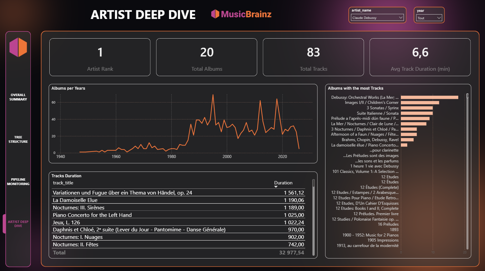

# 🎵 MusicBrainz Analytics

[](https://www.python.org/)
[](https://www.postgresql.org/)
[](https://powerbi.microsoft.com/)
[](LICENSE)

> **End-to-end data pipeline** extracting French artist data from the MusicBrainz API,
> storing it in PostgreSQL through a layered architecture, and exposing analytical
> dashboards in Power BI.

> ⚠️ **Work in progress** — Currently running on a reduced dataset due to local
> storage constraints. Architecture is fully designed to scale.

📄 **Full technical documentation:** [project_overview.md](project_overview.md)

---

## 🎼 Current Dataset

Current extraction scope:

- French artists only
- Configurable extraction limits
- Albums, releases, tracks and recordings
- Monitoring and quality metrics included

The architecture is designed to support larger-scale ingestion in future versions.

---

## 🏗️ Architecture

```text
MusicBrainz API
      ↓
Raw Layer (PostgreSQL)
      ↓
Staging Layer (cleaning & normalization)
      ↓
Analytics Layer (materialized views)
      ↓
Power BI Dashboards
```

Automated end-to-end via Windows Task Scheduler → Bash orchestration script →
Python extraction → PostgreSQL → materialized views refresh.

---

## ⭐ Key Features

- MusicBrainz API ingestion with pagination and configurable extraction limits
- PostgreSQL layered architecture (raw → staging → analytics)
- Materialized views for fast BI queries
- Scheduled execution via Windows Task Scheduler
- Pipeline monitoring, execution history & data quality reporting
- Power BI dashboards with drill-down capabilities

---

## 🛠️ Tech Stack

|           Category           |          Technology           |
|------------------------------|-------------------------------|
|         Language             |            Python             |
|           Database           |          PostgreSQL           |
|           API                |     MusicBrainz Public API    |
|            BI                |         Power BI Desktop      |
|       Orchestration          | Windows Task Scheduler + Bash |
|        Version Control       |          Git / GitHub         |

---

## 📊 Dashboards

### Overall Summary
Global KPIs, albums & tracks evolution over time, artist productivity overview.



### Tree Structure
Hierarchical drill-down: artist → release year → album → track.



### Pipeline Monitoring
Execution history, failure tracking, data quality reporting.



### Artist Deep Dive
Artist-level analysis: albums per year, top albums by track count, track duration details.



---

## 📁 Project Structure

## 📁 Project Structure

```text
musicbrainz-analytics/
├── data/
│   ├── analytics/                   # Analytics output data
│   ├── raw/                         # Raw ingested data
│   └── staging/                     # Staged/cleaned data
├── docs/
│   ├── screenshots/
│   │   ├── overall_summary.png
│   │   ├── tree_structure.png
│   │   ├── pipeline_monitoring.png
│   │   └── artist_deep_dive.png
│   ├── troubleshooting/
│   │   └── psycopg2_encoding_error.md
│   ├── architecture.md
│   ├── data_sources.md
│   ├── known_limitations.md         # Known limitations & engineering notes
│   ├── project_overview.md
│   └── roadmap.md
├── logs/                            # Timestamped execution logs
├── notebooks/                       # Exploratory notebooks
├── orchestration/
│   └── run_pipeline.sh              # End-to-end orchestration (Git Bash)
├── powerbi/                         # Power BI dashboard files
├── scripts/
│   ├── extraction/
│   │   └── api_musicbrainz.py       # API extraction pipeline
│   ├── transformation/              # SQL/Python transformation scripts
│   └── test_connection.py           # Database connection test
├── sql/
│   ├── analytics/
│   │   └── build_analytics.sql      # Materialized views, analytics tables, indexes
│   ├── materialized_views/
│   │   └── refresh_views.sql        # Materialized view refresh only
│   ├── staging/
│   │   └── build_staging.sql        # Staging table construction
│   └── setup_database.sql           # Schema creation, raw tables, indexes
├── .env.example                     # Environment variables template
├── .gitignore
├── LICENSE
├── README.md
└── requirements.txt
```

---

## ▶️ Quick Start

```bash
# Clone
git clone https://github.com/your-username/musicbrainz-analytics.git
cd musicbrainz-analytics

# Setup
python -m venv venv
venv\Scripts\activate
pip install -r requirements.txt

# Configure .env (DB credentials)

# Run pipeline
python scripts/extraction/api_musicbrainz.py
```

For detailed installation and execution instructions,
see `project_overview.md`.
---

## 🧠 Data Engineering Concepts Demonstrated

API ingestion · ELT architecture · Data warehouse layering · PostgreSQL schema design
· Materialized views · SQL performance optimization · Pipeline orchestration
· Execution monitoring · Data quality reporting · BI semantic modeling

Details for each concept: [docs/project_overview.md](docs/project_overview.md)

---

## 🚀 Roadmap

- [ ] Docker containerization
- [ ] Prefect / Airflow orchestration
- [ ] Cloud deployment (AWS / Azure / GCP)
- [ ] Larger-scale ingestion
- [ ] CI/CD pipeline

---

## 📄 License

This project is licensed under the MIT License — see [LICENSE](LICENSE) for details.